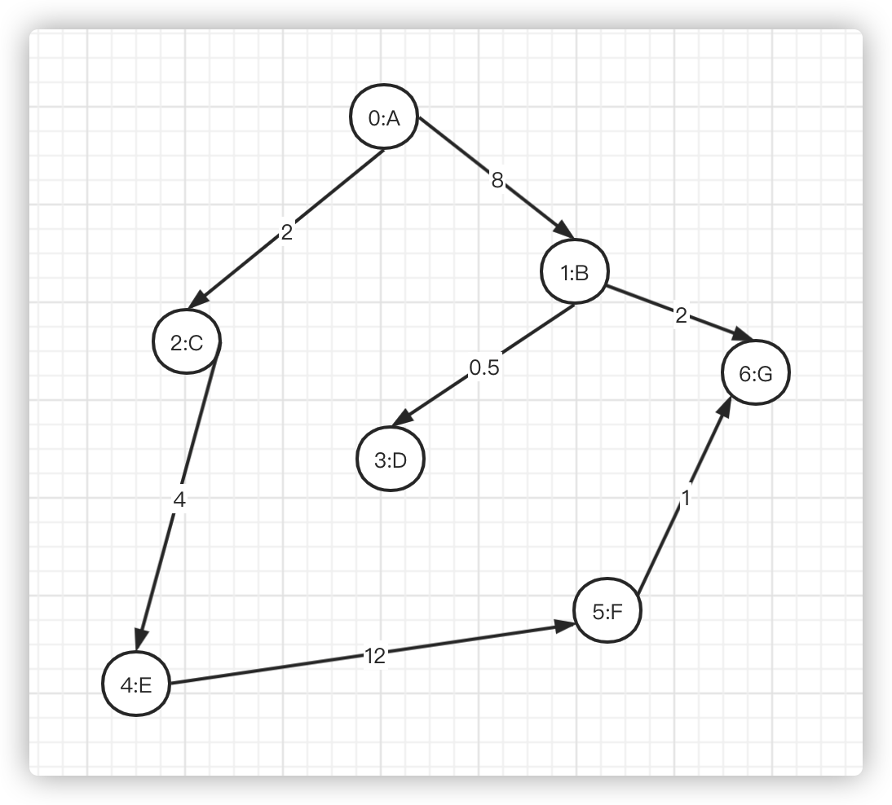

# 算法第二周总结

## 总结

### HashMap 源码小结

HashMap 作为非常常用的数据结构，是由数组和链表组合构成的数据机构。数组里面每个地方都存了 Key-Value 的实例，在 Java7 叫 Entry，在 Java8 叫 Node。

平常使用最多的就是 put 和 get 操作。put 方法的处理过程主要拆分为四个部分：

- Part1：特殊 key 值处理，key 为 null；
- Part2：计算table中目标bucket的下标；
- Part3：指定目标bucket，遍历Entry结点链表，若找到key相同的Entry结点，则做替换；
- Part4：若未找到目标Entry结点，则新增一个Entry结点；

HashMap是使用了哪些方法来有效解决哈希冲突的：

1. 使用 **链地址法**（使用散列表）来链接拥有相同hash值的数据；
2. 使用 **2次扰动函数**（hash函数）来降低哈希冲突的概率，使得数据分布更平均；
3. **引入红黑树** 进一步降低遍历的时间复杂度，使得遍历更快；

### 图的种类

#### 有向有权图

## 作业

### 散列表

- [有效的字母异位词](solution/ValidAnagram.java)
- [字母异位词分组](solution/GroupAnagrams.java)
- [两数之和](solution/TwoSum.java)

### 树

#### 二叉树

#### N 叉树

- [N 叉树的前序遍历](solution/TreePreorderTraversal.java)

#### 二叉堆

